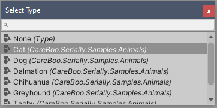

# SerializableType


`SerializableType` can be used to Serialize a `System.Type` reference. The UI is very similar to the [ShowSerializeReference](ShowSerializeReference.md) attribute.

Using a `TypeFilter` attribute, you can filter the shown types by a base type, or a custom filter delegate. The delegate name given to `TypeFilter` must refer to a delegate of type `Func<IEnumerable<Type>, IEnumerable<Type>>`.

```cs
using CareBoo.Serially;

public interface IPet {}
public class Cat : IPet {}
public class Dog : IPet {}

public class MyBehavior : MonoBehaviour
{
    [TypeFilter(derivedFrom: typeof(IPet))] // only show types derived from IPet
    public SerializableType SomePetType;

    public IEnumerable<Type> MyCustomFilter(IEnumerable<Type> type)
    {
        var acceptedTypes = new[] { typeof(int), SomePetType.Type };
        return acceptedTypes.Contains(type);
    }

    [TypeFilter(nameof(MyCustomFilter))] // must be a Func<IEnumerable<Type>, IEnumerable<Type>>
    public SerializableType SelectedSomePetTypeOrInt;
}
```

## Selecting Types

Similar to the [ShowSerializeReference](ShowSerializeReference.md) attribute, clicking the circle button at the right edge of the label opens up an editor window with a list of types. Double click a type in the list to select it.


