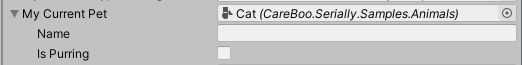

# ShowSerializeReference



Use the `ShowSerializeReferenceAttribute` to show an inspector field next to the `SerializeReference` field. The inspector field can be used to inject a new `Serializable` value into the `SerializeReference` field.

```cs
using CareBoo.Serially;

public class MyBehavior : MonoBehaviour
{
    [SerializeReference]
    [ShowSerializeReference]
    public IPet MyCurrentPet; // The field shown in the image above.
}

public interface IPet
{
    string Name { get; set; }
    string Noise { get;}
}

[ProvideSourceInfo, Serializable]
public class Cat : IPet
{
    public string Name;
    public bool IsPurring;

    string IPet.Name { get => Name; set => Name = value; }
    string IPet.Noise => "Meow";
}
```

## Selecting a New Value

Clicking the circle button next to the type-name label opens up an editor window with a list of injectable types. Double click a type out of that list to inject a new instance of that type into the `SerializeReference` field.

> [!Note] To instantiate the type, it must either be a value type (`struct`) or have a parameterless constructor.
> If it doesn't, an error will show in the console.


