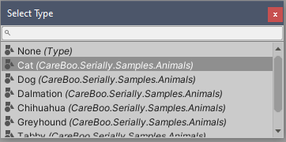

ShowSerializeReference
======================


Use the `ShowSerializeReferenceAttribute` to show an inspector field next to the `SerializeReference` field. The inspector field can be used to inject a `Serializable` derived type into the `SerializeReference` field.

```cs
using CareBoo.Serially;

public interface IPet 
{
    string Name { get; set; }
    string Noise { get;}
}

[ProvideSourceInfo, Serializable]
public class Cat : IPet
{
    public string Name;
    public bool IsPurring;

    string IPet.Name { get => Name; set => Name = value; }
    string IPet.Noise => "Meow";
}

public class MyBehavior : MonoBehaviour
{
    [SerializeReference]
    [ShowSerializeReference]
    public IPet MyCurrentPet; // Set to Cat in the image above.
}
```



Clicking the circle next to the type inspector field opens up a type list window that can be used to inject different types into the `SerializeReference` field.
