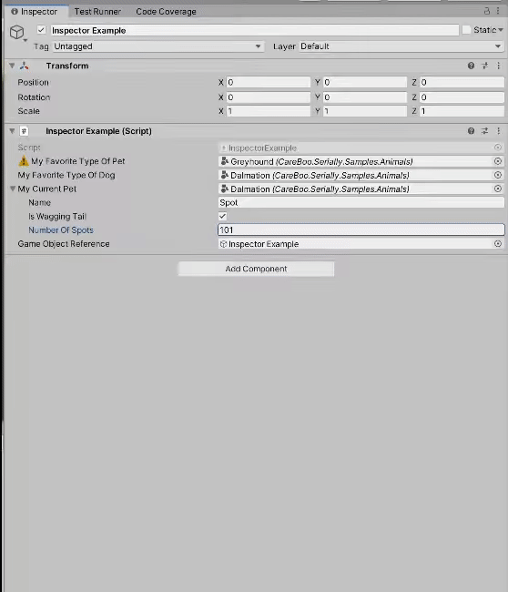

Serially
========

Extends the Unity Editor with some serialization tools:

- [ShowSerializeReference](Packages/com.careboo.serially/Documentation/ShowSerializeReference.md)
  - Adds an inspector to `SerializeReference` fields.
  - The inspector can be used to select a type to instantiate into the field.
- [SerializableType](Packages/com.careboo.serially/Documentation/SerializableType.md)
  - Serialize a `System.Type` reference.

Installation
------------

This project can be installed as a UPM package. There are two easy ways to install the package:

1. **GitHub Packages Registry**. [Here's](https://forum.unity.com/threads/using-github-packages-registry-with-unity-package-manager.861076/) a post in the Unity Forums giving steps on how to set this up.
2. **OpenUPM**. You can find this package on OpenUPM [here](https://openupm.com/packages/com.careboo.serially)
