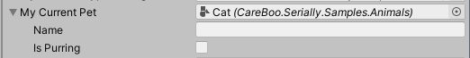

<h1 id="Serially">
Serially

</h1>
<p>
  <a href="LICENSE.md">
    
  </a>
  </br>
  <a href="https://github.com/CareBoo/Serially/actions/workflows/test.yaml">
    
  </a>
  </br>
  <a href="https://www.npmjs.com/package/com.careboo.serially">
    
  </a>
  </br>
  <a href="https://openupm.com/packages/com.careboo.serially/">
    
  </a>
</p>

</h1>

Extends the Unity Editor with type picking functionalities.

- [Usage](#usage)
  - [`ShowSerializeReferenceAttribute`](#showserializereferenceattribute)
  - [`SerializableType`](#serializabletype)
- [Installation](#installation)
  - [Scoped Registries](#scoped-registries)
  - [Local Packages](#local-packages)
- [Documentation](#documentation)

## Usage

### `ShowSerializeReferenceAttribute`



Use the `ShowSerializeReferenceAttribute` on a serializable field with `SerializeReference` to add a type picker inspector to that field.

```cs
using UnityEngine;
using CareBoo.Serially;

public class MyBehavior : MonoBehaviour
{
  [SerializeReference, ShowSerializeReference]
  public IPet myPet;
}
```

### `SerializableType`


Serialize any type with `SerializableType` class.

```cs
using UnityEngine;
using CareBoo.Serially;

public class MyBehaviour : MonoBehaviour
{
  public SerializableType myType;
  
  private void Start()
  {
    Debug.Log("Serialized type is " + myType.Type.FullName);
  }
}
```

## Installation

### Scoped Registries

| Registry | URL                         |
|----------|:----------------------------|
| NPM      | https://registry.npmjs.org/ |
| OpenUPM  | https://package.openupm.com |

This project can be installed as a UPM package on [OpenUPM](https://openupm.com/packages/com.careboo.serially/)
or [npmjs](https://www.npmjs.com/package/com.careboo.serially) by adding those as scoped registries. [See the Unity manual](https://docs.unity3d.com/Manual/upm-scoped.html) for more information on Scoped Registries.

### Local Packages

Alternatively, you can install this directly as either a tarball or unity asset package from
the [latest release](https://github.com/CareBoo/Serially/releases/latest).

## Documentation

Documentation is hosted [here on GitHub pages](https://careboo.github.io/Serially/2.2).
